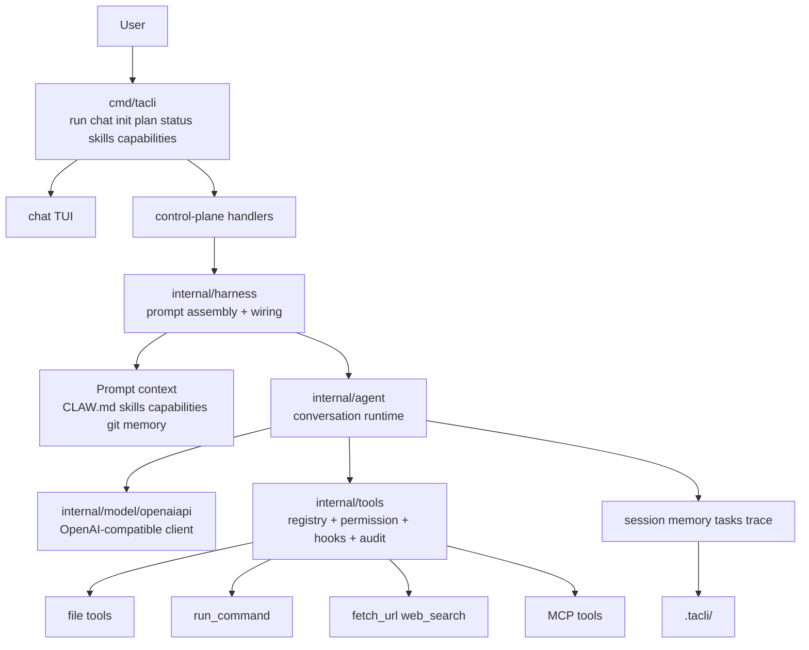

# tacli

`tacli` is a lightweight terminal coding agent with a small runtime surface:

- one Go binary
- one workspace
- one OpenAI-compatible model endpoint
- no Node.js
- no Python runtime requirement
- no Electron
- no background daemon

Chinese version: [README.zh-CN.md](README.zh-CN.md)

## What It Does

`tacli` covers the core agent workflow without turning the machine into a full agent platform.

Core functionality:

- one-shot task execution: `tacli run ...`
- interactive chat with session persistence: `tacli chat`
- repository bootstrap: `tacli init`
- direct control-plane commands: `plan`, `status`, `skills`, `capabilities`
- file reading, writing, editing, search, web fetch, web search, review diff
- bounded shell execution with approval and command-pattern policy
- background jobs for exploration and verification
- persistent memory across global, team, and project scope
- capability packs and discovered skills injected into prompt context
- local session, trace, audit, and task storage under `.tacli/`

## Quick Start

```bash
export MODEL_BASE_URL="http://127.0.0.1:11434/v1"
export MODEL_NAME="your-model"

tacli init
tacli status
tacli "inspect this repository and summarize the architecture"
```

Interactive mode:

```bash
tacli chat
```

Dangerous mode for trusted local work:

```bash
tacli run --dangerously "go test ./..."
tacli chat --dangerously
```

## Top-Level Commands

| Command | Purpose |
| --- | --- |
| `tacli` | Start chat on interactive terminals, otherwise require an explicit task |
| `tacli run <task>` | Run one task and exit |
| `tacli chat` | Multi-turn interactive session |
| `tacli init` | Scaffold `CLAW.md`, `.claw/`, and local ignore rules |
| `tacli plan` | Print `plan.md` |
| `tacli status` | Show workspace, state, plan, skills, capabilities, and session status |
| `tacli skills` | Show bundled and discovered skills |
| `tacli capabilities` | Show bundled capability packs |
| `tacli ping` | Check endpoint/model connectivity |
| `tacli models` | List models from the provider |
| `tacli version` | Print embedded version |

## Chat Control Plane

`chat` exposes the runtime control surface directly inside the session.

High-value commands:

- `/init`
- `/plan`
- `/status`
- `/policy ...`
- `/skills`
- `/capabilities`
- `/session ...`
- `/memory ...`
- `/bg ...`
- `/jobs`
- `/audit ...`
- `/trace ...`

The design goal is parity: common control actions should work both as direct CLI commands and as slash commands in chat.

## Core Runtime Model

At a high level, `tacli` is built from four layers:

1. CLI and TUI entrypoints
2. Control plane and prompt assembly
3. Conversation runtime
4. Tool and provider execution

### Turn Loop

Each task turn follows the same path:

1. Build prompt context from workspace state, instructions, skills, capability packs, git state, and memory
2. Send messages and tool schema to the model
3. Execute tool calls through the registry and permission layer
4. Append tool results back into the session
5. Retry, compact, fallback, or finish based on runtime policy

## Architecture Diagram



## Code Map

The repo is easier to understand if you read it in this order:

- [cmd/tacli/main.go](/root/tiny-agent-cli/cmd/tacli/main.go)  
  CLI entrypoint, chat runtime, slash commands, and top-level command routing.

- [cmd/tacli/control.go](/root/tiny-agent-cli/cmd/tacli/control.go)  
  Direct control-plane commands such as `plan`, `status`, `skills`, and `capabilities`.

- [cmd/tacli/init.go](/root/tiny-agent-cli/cmd/tacli/init.go)  
  Repository bootstrap for `CLAW.md` and local scaffolding.

- [internal/harness/factory.go](/root/tiny-agent-cli/internal/harness/factory.go)  
  Composition root: builds prompt context, model client, agent, hooks, audit sinks, and permissions.

- [internal/agent/agent.go](/root/tiny-agent-cli/internal/agent/agent.go)  
  Conversation state machine: retries, compaction, fallback behavior, and task orchestration.

- [internal/agent/prompt.go](/root/tiny-agent-cli/internal/agent/prompt.go)  
  System prompt assembly from runtime context, instruction files, skills, capability packs, and memory.

- [internal/tools/registry.go](/root/tiny-agent-cli/internal/tools/registry.go)  
  Tool registration, validation, policy checks, hook execution, and audit integration.

- [internal/tools/runtime.go](/root/tiny-agent-cli/internal/tools/runtime.go)  
  Permission evaluation and tool middleware behavior.

- [internal/tools/permissions.go](/root/tiny-agent-cli/internal/tools/permissions.go)  
  Persistent tool policy and command-pattern rules for `run_command`.

- [internal/tools/capability.go](/root/tiny-agent-cli/internal/tools/capability.go)  
  Bundled capability pack definitions.

## Deep Dive: Core Features

### 1. Prompt Context

Before the model sees a task, `tacli` assembles a compact but structured context:

- runtime details: workdir, shell, model, approval mode
- git branch and dirty status
- instruction files such as `CLAW.md`
- discovered skills
- bundled capability packs
- scoped memory

This keeps the runtime configurable without requiring a large external framework.

### 2. Tool Runtime

The tool layer is not a bag of helpers. It is a policy-enforced execution pipeline:

- schema validation
- permission decision
- pre/post hooks
- audit logging
- tool execution

That structure is what allows `run_command` policy, audit replay, and background orchestration to stay coherent.

### 3. Permission Model

`tacli` has two permission axes:

- tool-level policy
- command-pattern policy for `run_command`

Examples:

```text
/policy tool write_file deny
/policy command add allow git status *
/policy command add deny git push *
```

This keeps trusted local commands fast while still blocking high-blast-radius operations.

### 4. Capability Packs

Capability packs are higher-level workflow bundles. They are not new tools. They are reusable guidance units that tell the agent when to prefer a known workflow shape.

Bundled packs currently cover:

- `repo-research`
- `web-app`
- `release`
- `ops`

### 5. Deterministic Parity Harness

The repository now includes deterministic CLI parity scenarios that exercise:

- control-plane commands
- slash-command policy flow
- session resume
- repeated tool failures
- empty-answer fallback
- provider `429` retry

Those tests are meant to pin runtime behavior without requiring live model access for every regression run.

## Repository Bootstrap

Run this once inside a repo:

```bash
tacli init
```

It creates:

- `.claw/`
- `CLAW.md`
- local ignore rules for `.tacli/` and `CLAW.local.md`

`CLAW.md` is generated from repo detection, so the starter guidance is different for Go, Rust, Python, and Node repositories.

## State Layout

By default, local runtime state lives in `.tacli/`:

- `sessions/`
- `transcripts/`
- `memory.json`
- `permissions.json`
- audit logs
- trace logs

This keeps agent state local to the workspace instead of hiding it in a global daemon.

## Install

Linux or macOS:

```bash
curl -fsSL https://raw.githubusercontent.com/axeprpr/tiny-agent-cli/main/scripts/install.sh | bash
```

Windows PowerShell:

```powershell
iwr https://raw.githubusercontent.com/axeprpr/tiny-agent-cli/main/scripts/install.ps1 -UseBasicParsing | iex
```

Optional install variables:

- `TACLI_VERSION`
- `TACLI_INSTALL_DIR`

## Build and Release

Local release build:

```bash
./scripts/build-release.sh <version> dist/<version>
```

The generated binaries are raw executables without an extra archive step.

## Development Notes

- Current development roadmap: [plan.md](plan.md)
- Release page sources: [release-site/README.md](release-site/README.md)
