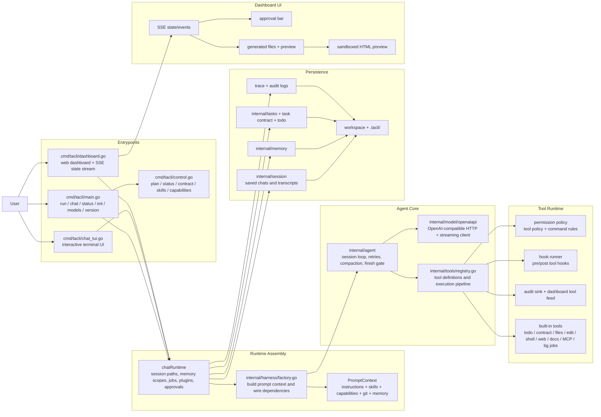
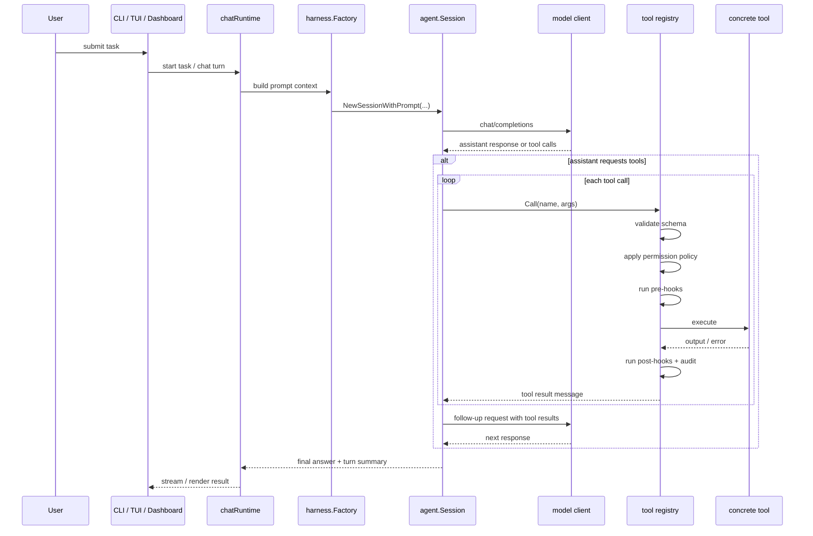
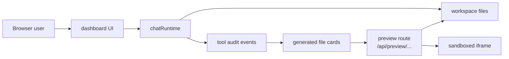
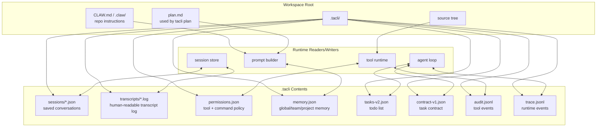

# tacli

`tacli` is a small coding agent for one workspace, one binary, and one OpenAI-compatible model endpoint.

It keeps the runtime narrow:

- Go binary only
- local workspace state under `.tacli/`
- built-in tool runtime with permissions, hooks, audit, and background jobs
- terminal chat, one-shot execution, and a lightweight web dashboard

Chinese version: [README.zh-CN.md](README.zh-CN.md)

## Architecture

## Features

- Terminal-first runtime: `chat`, `run`, `status`, `plan`, `contract`, and background jobs in one binary
- Web dashboard: browser chat UI with streaming output, approval prompts, tool-call cards, generated-file cards, and session state
- File inspection: built-in DOCX/PDF tools, text file viewer, downloads, and sandboxed HTML preview for generated pages
- Safe execution controls: permission modes, command rules, approval flow, audit log, and hook integration
- Local persistence: conversations, transcripts, memory, task contract, todos, trace, and audit state under `.tacli/`
- Narrow deployment model: one OpenAI-compatible endpoint, one workspace root, one local state directory

## Architecture

### 1. Runtime Overview



### 2. Turn Execution Flow



### 3. Dashboard File and Preview Flow



### 4. State and File Layout



## Repository Map

| Path | Responsibility |
| --- | --- |
| `cmd/tacli/` | CLI entrypoints, interactive chat runtime, TUI, slash-command parity, background job manager |
| `cmd/tacli/dashboard.go` + `cmd/tacli/dashboard_assets/` | browser dashboard, SSE state stream, approvals, tool cards, file preview and downloads |
| `internal/harness/` | dependency wiring, prompt context construction, model/agent/tool assembly |
| `internal/agent/` | session loop, turn summaries, retries, compaction, finish gate, orchestration |
| `internal/tools/` | tool registry, permission layer, hooks, audit, task contract, file/shell/web/doc inspection/MCP tools |
| `internal/model/openaiapi/` | OpenAI-compatible HTTP client and streaming transport |
| `internal/session/` | saved sessions and transcript persistence |
| `internal/memory/` | persistent memory store |
| `internal/tasks/` | lightweight task records used by the CLI control plane |
| `release-site/` | static release page |
| `scripts/` | release, install, parity, and regression helpers |

## Usage

### 1. Build

```bash
go build -o tacli ./cmd/tacli
```

### 2. Configure a Model Endpoint

```bash
export MODEL_BASE_URL="https://api.openai.com/v1"
export MODEL_NAME="gpt-5-mini"
export MODEL_API_KEY="your-api-key"
```

Common runtime knobs:

- `AGENT_APPROVAL=confirm|dangerously`
- `AGENT_WORKDIR=/path/to/repo`
- `AGENT_STATE_DIR=/path/to/.tacli`
- `MODEL_CONTEXT_WINDOW=...`

### 3. Run It

```bash
tacli ping
tacli chat
```

One-shot task:

```bash
tacli run "inspect this repository and summarize the architecture"
```

Trusted local mode:

```bash
tacli chat --dangerously
tacli run --dangerously "go test ./..."
```

Web dashboard:

```bash
tacli dashboard --host 127.0.0.1 --port 8421
```

Dashboard capabilities:

- live streaming conversation state over SSE
- approval actions for commands and writes
- tool-call timeline with input/output samples
- generated file cards with `View`, `Download`, and `Preview` for `.html`
- sandboxed HTML preview via `/api/preview/...`

### 4. Useful Commands

```bash
tacli status
tacli models
tacli version
tacli plan
tacli contract
```

Inside chat:

```text
/status
/plan
/contract
/skills
/capabilities
/policy ...
/bg ...
```

## Notes

- `tacli` persists local state under `.tacli/` by default.
- `tacli plan` reads `plan.md` from the workspace root.
- background jobs require `--dangerously` because they cannot pause for interactive approvals.
- dashboard HTML preview is sandboxed and serves only an allowlisted set of static asset extensions.
- malformed PDFs now fail as normal tool errors instead of crashing the dashboard process.
