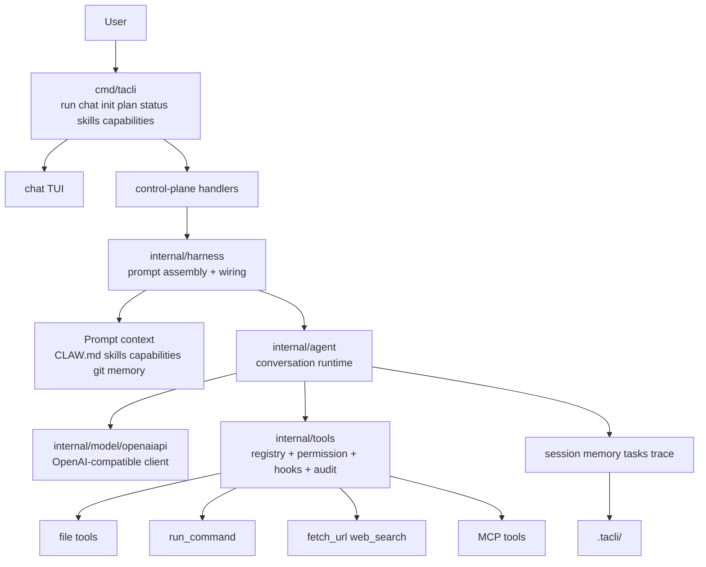

# tacli

`tacli` 是一个轻量的终端 coding agent，运行时表面积很小：

- 一个 Go 二进制
- 一个工作区
- 一个 OpenAI 兼容模型接口
- 不依赖 Node.js
- 不要求 Python 运行时
- 不需要 Electron
- 不需要常驻后台服务

英文版见 [README.md](README.md)。

## 它能做什么

`tacli` 覆盖的是核心 agent 工作流，不把机器变成一整套重平台。

核心能力：

- 单次任务执行：`tacli run ...`
- 交互式多轮会话：`tacli chat`
- 仓库初始化：`tacli init`
- 直接控制面命令：`plan`、`status`、`skills`、`capabilities`
- 读文件、写文件、精确编辑、搜索、抓网页、web search、diff review
- 带审批和命令模式策略的 shell 执行
- 用于探索和验证的后台任务
- 全局、团队、项目三级持久化记忆
- 注入到提示词中的 capability packs 和本地 skills
- 保存在 `.tacli/` 下的 session、trace、audit、task 状态

## 快速开始

```bash
export MODEL_BASE_URL="http://127.0.0.1:11434/v1"
export MODEL_NAME="your-model"

tacli init
tacli status
tacli "inspect this repository and summarize the architecture"
```

交互模式：

```bash
tacli chat
```

信任本地环境时可以直接跳过审批：

```bash
tacli run --dangerously "go test ./..."
tacli chat --dangerously
```

## 顶层命令

| 命令 | 作用 |
| --- | --- |
| `tacli` | 在交互终端里进入 chat；非交互环境要求显式任务 |
| `tacli run <task>` | 执行一次任务并退出 |
| `tacli chat` | 多轮交互会话 |
| `tacli init` | 生成 `CLAW.md`、`.claw/` 和本地忽略规则 |
| `tacli plan` | 输出根目录 `plan.md` |
| `tacli status` | 输出工作区、状态目录、计划、skills、capabilities、session 状态 |
| `tacli skills` | 输出内置和发现到的 skills |
| `tacli capabilities` | 输出内置 capability packs |
| `tacli ping` | 检查模型接口是否可用 |
| `tacli models` | 列出 provider 返回的模型 |
| `tacli version` | 输出版本 |

## Chat 控制面

`chat` 把运行时控制面直接暴露在会话里。

高价值命令：

- `/init`
- `/plan`
- `/status`
- `/policy ...`
- `/skills`
- `/capabilities`
- `/session ...`
- `/memory ...`
- `/bg ...`
- `/jobs`
- `/audit ...`
- `/trace ...`

设计目标是做 CLI 命令和 chat slash command 的能力对齐：常用控制操作，两边都能跑。

## 核心运行模型

从高层看，`tacli` 由四层组成：

1. CLI 和 TUI 入口
2. 控制面和提示词装配
3. 会话运行时
4. 工具和 provider 执行层

### 单轮执行路径

每一轮任务都走同一条链路：

1. 从工作区状态、指令文件、skills、capability packs、git 状态、记忆构建 prompt context
2. 把消息和 tool schema 发给模型
3. 通过 registry 和 permission layer 执行 tool call
4. 把 tool 结果回写进 session
5. 按运行时策略决定重试、压缩、fallback 或结束

## 架构图



## 代码地图

理解仓库，建议按这个顺序看：

- [cmd/tacli/main.go](/root/tiny-agent-cli/cmd/tacli/main.go)  
  CLI 入口、chat runtime、slash commands、顶层命令分发。

- [cmd/tacli/control.go](/root/tiny-agent-cli/cmd/tacli/control.go)  
  `plan`、`status`、`skills`、`capabilities` 这些直接控制面命令。

- [cmd/tacli/init.go](/root/tiny-agent-cli/cmd/tacli/init.go)  
  `CLAW.md` 和本地初始化脚手架。

- [internal/harness/factory.go](/root/tiny-agent-cli/internal/harness/factory.go)  
  组合根，负责装配 prompt context、model client、agent、hooks、audit 和 permissions。

- [internal/agent/agent.go](/root/tiny-agent-cli/internal/agent/agent.go)  
  会话状态机，负责重试、压缩、fallback 和任务编排。

- [internal/agent/prompt.go](/root/tiny-agent-cli/internal/agent/prompt.go)  
  从运行时上下文、指令文件、skills、capability packs、memory 组装 system prompt。

- [internal/tools/registry.go](/root/tiny-agent-cli/internal/tools/registry.go)  
  tool 注册、校验、策略判断、hook 执行、audit 接入。

- [internal/tools/runtime.go](/root/tiny-agent-cli/internal/tools/runtime.go)  
  permission 评估和 tool middleware 行为。

- [internal/tools/permissions.go](/root/tiny-agent-cli/internal/tools/permissions.go)  
  持久化 tool policy 和 `run_command` 的命令模式规则。

- [internal/tools/capability.go](/root/tiny-agent-cli/internal/tools/capability.go)  
  内置 capability pack 定义。

## 深度解读：tacli 核心功能

### 1. Prompt Context

在模型看到任务前，`tacli` 会先组一层紧凑但结构化的上下文：

- 运行时信息：workdir、shell、model、approval mode
- git branch 和 dirty 状态
- `CLAW.md` 这类指令文件
- 本地发现到的 skills
- 内置 capability packs
- 按作用域命中的 memory

这让运行时可以配置化，但不需要很重的外部框架。

### 2. Tool Runtime

工具层不是一堆零散 helper，而是一条受策略约束的执行管线：

- schema 校验
- permission 判断
- pre/post hooks
- audit 记录
- 真正执行 tool

这层结构是 `run_command` 策略、audit 回放、后台任务编排能保持一致的基础。

### 3. 权限模型

`tacli` 现在有两层权限轴：

- tool 级策略
- `run_command` 的命令模式策略

例如：

```text
/policy tool write_file deny
/policy command add allow git status *
/policy command add deny git push *
```

这样既能让可信本地命令保持高效率，也能挡住 blast radius 很大的操作。

### 4. Capability Packs

Capability packs 是高层工作流约束，不是新工具。它们的作用是告诉 agent 在某类任务里优先采用已经验证过的工作路径。

当前内置：

- `repo-research`
- `web-app`
- `release`
- `ops`

### 5. Deterministic Parity Harness

仓库里已经补了 deterministic CLI parity 场景，用来固定这些运行时行为：

- 控制面命令
- slash command 的 policy 流程
- session 恢复
- repeated tool failures
- empty-answer fallback
- provider `429` 重试

这类测试的目标，是在不依赖 live model 的前提下钉住核心回归面。

## 仓库初始化

在仓库里先跑一次：

```bash
tacli init
```

它会创建：

- `.claw/`
- `CLAW.md`
- 针对 `.tacli/` 和 `CLAW.local.md` 的本地忽略规则

`CLAW.md` 不是固定模板，会根据仓库类型生成起步指导，所以 Go、Rust、Python、Node 仓库拿到的内容不一样。

## 状态目录

默认情况下，本地运行时状态保存在 `.tacli/`：

- `sessions/`
- `transcripts/`
- `memory.json`
- `permissions.json`
- audit logs
- trace logs

这让 agent 状态跟工作区走，而不是藏在某个全局守护进程里。

## 安装

Linux 或 macOS：

```bash
curl -fsSL https://raw.githubusercontent.com/axeprpr/tiny-agent-cli/main/scripts/install.sh | bash
```

Windows PowerShell：

```powershell
iwr https://raw.githubusercontent.com/axeprpr/tiny-agent-cli/main/scripts/install.ps1 -UseBasicParsing | iex
```

可选安装变量：

- `TACLI_VERSION`
- `TACLI_INSTALL_DIR`

## 构建与发布

本地构建发布产物：

```bash
./scripts/build-release.sh <version> dist/<version>
```

生成的是原始可执行文件，不额外套压缩包。

## 开发说明

- 当前开发计划：[plan.md](plan.md)
- 发布页说明：[release-site/README.md](release-site/README.md)
