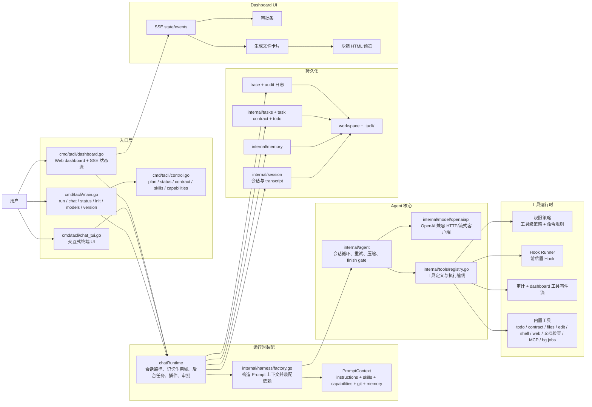
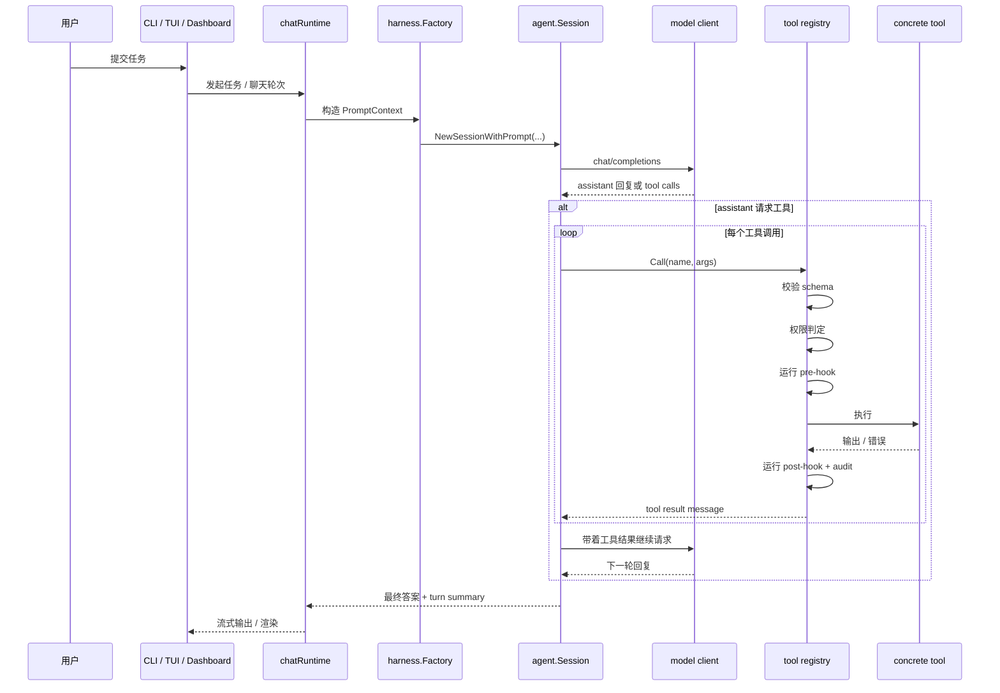
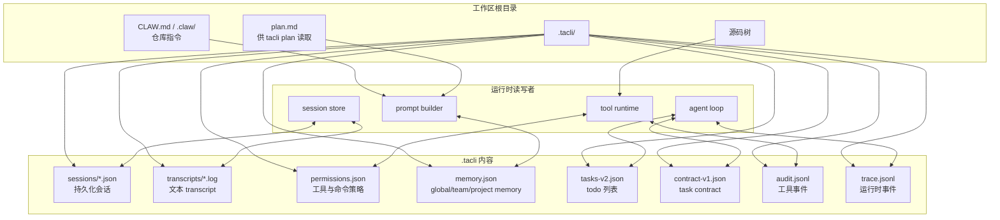

# tacli

`tacli` 是一个尽量收敛复杂度的代码 Agent：一个二进制、一个工作区、一个 OpenAI 兼容模型接口。

它的运行面很小：

- 只有 Go 二进制
- 本地状态统一放在 `.tacli/`
- 内置工具运行时，带权限、Hook、审计和后台任务
- 同时支持终端聊天、单次任务执行和轻量 Web dashboard

English version: [README.md](README.md)

## 功能

- 终端优先：`chat`、`run`、`status`、`plan`、`contract`、后台任务都在一个二进制里
- Web dashboard：浏览器聊天界面，支持流式输出、审批条、工具卡片、生成文件卡片和会话状态
- 文件检查：内置 DOCX/PDF 检查工具、文本查看、下载，以及对生成网页的沙箱 HTML 预览
- 安全执行控制：权限模式、命令规则、审批流、审计日志和 Hook 集成
- 本地持久化：会话、transcript、memory、task contract、todo、trace、audit 都落在 `.tacli/`
- 简单部署：一个 OpenAI 兼容接口、一个工作区根目录、一个本地状态目录

## 架构

### 1. 运行时总览



### 2. 单轮执行流程



### 3. Dashboard 文件与预览流

```mermaid
flowchart LR
    user[浏览器用户]
    dashboard[dashboard UI]
    runtime[chatRuntime]
    audit[工具审计事件]
    files[生成文件卡片]
    preview[/api/preview/...]
    iframe[sandbox iframe]
    workspace[工作区文件]

    user --> dashboard
    dashboard --> runtime
    runtime --> audit
    audit --> files
    runtime --> workspace
    files --> preview
    preview --> workspace
    preview --> iframe
```

### 4. 状态与文件布局



## 仓库结构

| 路径 | 作用 |
| --- | --- |
| `cmd/tacli/` | CLI 入口、交互式聊天运行时、TUI、slash command 对齐、后台任务管理 |
| `cmd/tacli/dashboard.go` + `cmd/tacli/dashboard_assets/` | 浏览器 dashboard、SSE 状态流、审批、工具卡片、文件预览与下载 |
| `internal/harness/` | 依赖装配、Prompt 上下文构造、模型/Agent/工具初始化 |
| `internal/agent/` | 会话循环、turn summary、重试、上下文压缩、finish gate、编排 |
| `internal/tools/` | 工具注册表、权限层、Hook、审计、task contract、文件/命令/Web/文档检查/MCP 工具 |
| `internal/model/openaiapi/` | OpenAI 兼容模型客户端与流式传输 |
| `internal/session/` | 会话和 transcript 持久化 |
| `internal/memory/` | 持久化记忆 |
| `internal/tasks/` | CLI 控制面使用的轻量任务记录 |
| `release-site/` | 静态发布页 |
| `scripts/` | 发布、安装、回归、对比脚本 |

## 使用

### 1. 构建

```bash
go build -o tacli ./cmd/tacli
```

### 2. 配置模型接口

```bash
export MODEL_BASE_URL="https://api.openai.com/v1"
export MODEL_NAME="gpt-5-mini"
export MODEL_API_KEY="your-api-key"
```

常用环境变量：

- `AGENT_APPROVAL=confirm|dangerously`
- `AGENT_WORKDIR=/path/to/repo`
- `AGENT_STATE_DIR=/path/to/.tacli`
- `MODEL_CONTEXT_WINDOW=...`

### 3. 运行

```bash
tacli ping
tacli chat
```

单次任务：

```bash
tacli run "inspect this repository and summarize the architecture"
```

本地信任模式：

```bash
tacli chat --dangerously
tacli run --dangerously "go test ./..."
```

Web dashboard：

```bash
tacli dashboard --host 127.0.0.1 --port 8421
```

Dashboard 当前支持：

- SSE 流式会话状态
- 命令/写文件审批条
- 工具调用时间线与输入输出摘要
- 生成文件卡片里的 `View`、`Download`、`.html` 的 `Preview`
- 通过 `/api/preview/...` 做沙箱 HTML 预览

### 4. 常用命令

```bash
tacli status
tacli models
tacli version
tacli plan
tacli contract
```

聊天内常用 slash commands：

```text
/status
/plan
/contract
/skills
/capabilities
/policy ...
/bg ...
```

## 说明

- 默认本地状态目录是 `.tacli/`
- `tacli plan` 会读取工作区根目录的 `plan.md`
- 后台任务需要 `--dangerously`，因为它们不能在中途等待交互式审批
- dashboard 的 HTML 预览是沙箱化的，只允许一小部分静态资源扩展名
- malformed PDF 现在会作为普通工具错误返回，不会再把 dashboard 进程打崩
